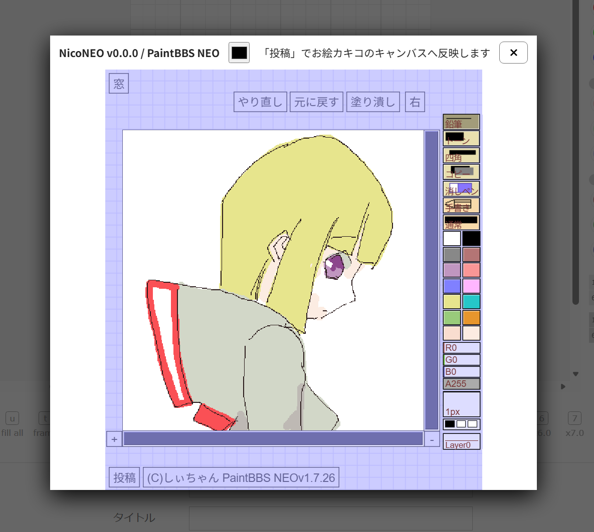
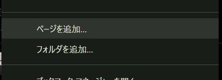
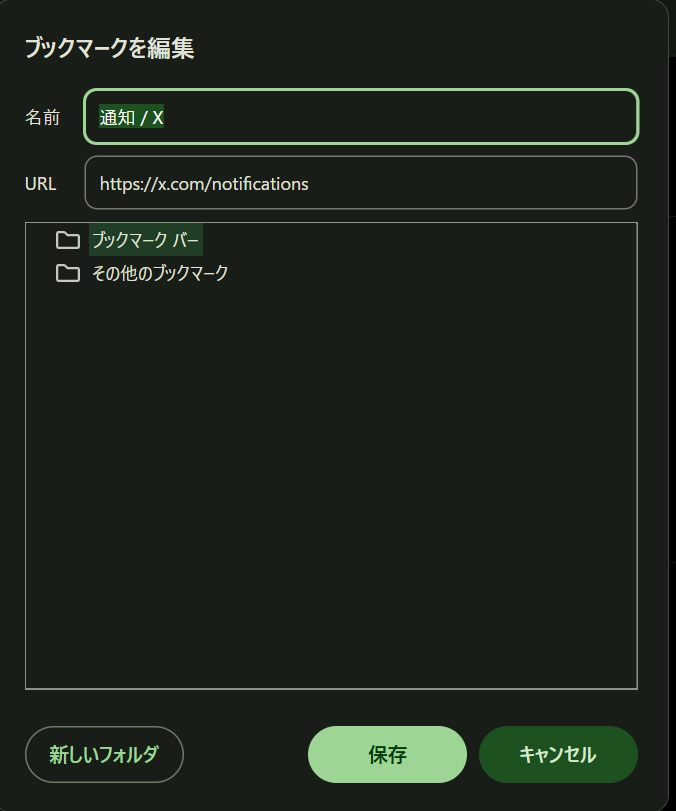
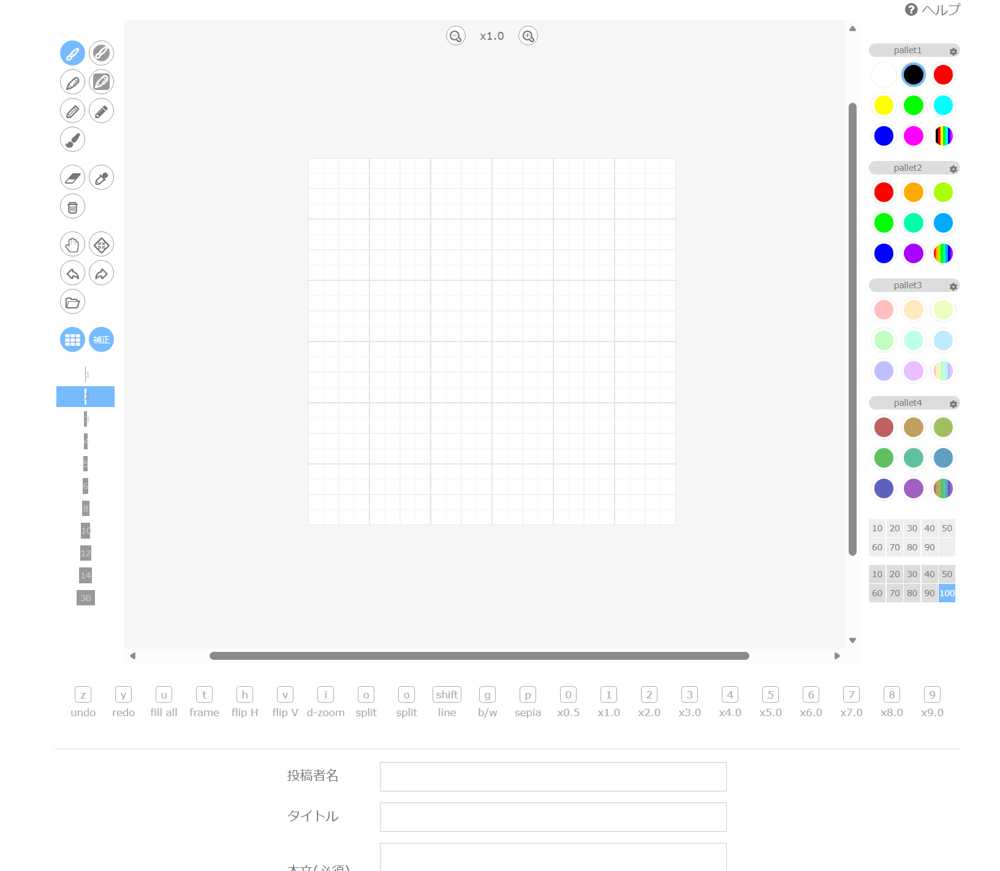
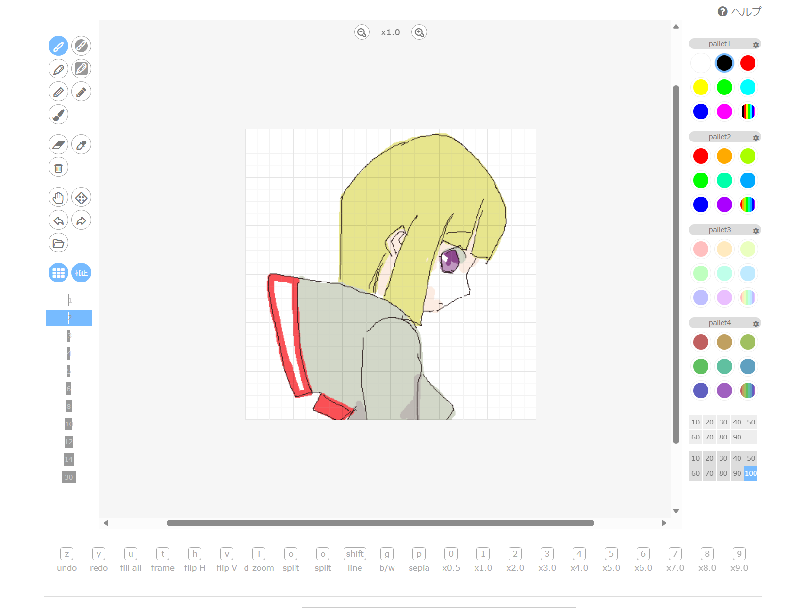

# NicoNEO bookmarklet



## 何

ニコニコ大百科のお絵カキコ編集画面で PaintBBS NEO を開き、描画結果を既存の投稿キャンバスへ戻すブックマークレットです。認証・実際の投稿は大百科の標準フォームを使うため、このコードが資格情報や投稿 API を扱うことはありません。

配布版のバージョンは [package.json](package.json) の `version` で管理します。初期値は `0.0.0` です。ここを更新してビルドすると、NEO ダイアログの表示へ反映されます。
CODEX使用。

## つかいかた

まずブックマークレットを作ります。

### GoogleChromeの場合

「ページを追加」を選択します。



「ブックマークを編集」で分かりやすい名前にして、URLを`dist/bookmarklet-loader.url.txt`の内容にします。



コピペ用

```javascript
javascript:(async()=>{const i='nico-neo-loader';if(document.getElementById(i))return;let v='main';try{const r=await fetch('https://api.github.com/repos/sakots/niconeo/commits/main',{cache:'no-store',credentials:'omit',headers:{Accept:'application/vnd.github+json'},referrerPolicy:'no-referrer'});if(r.ok){const j=await r.json();if(typeof j.sha==='string'&&/^[0-9a-f]{40}$/.test(j.sha))v=j.sha}}catch{}const s=document.createElement('script');s.id=i;s.charset='UTF-8';s.src='https://cdn.jsdelivr.net/gh/sakots/niconeo@'+v+'/dist/bookmarklet.js'+(v==='main'?'?v='+Date.now():'');s.onerror=()=>{s.remove();alert('NicoNEOの読み込みに失敗しました。')};(document.head||document.documentElement).appendChild(s)})()
```

ニコニコ大百科のスレッドで、「お絵カキコする」を選択し、絵を描く画面にします。



ここで、先ほどのブックマークを呼び出して絵をかきます。

「投稿」を押すと、お絵カキコの画面にイラストが転写されます。



できた！

## ビルドと導入

```sh
npm install
npm run check
npm run build
```

生成される `dist/bookmarklet.url.txt` の一行全体を、ブックマークの URL に貼り付けてください。お絵カキコ編集画面でそのブックマークを実行し、NEO 側の「投稿」を押すと絵が元のキャンバスへ反映されます。続けて元ページの「投稿」ボタンで送信してください。

### 短いローダー版

`appneo` と同じ GitHub API + jsDelivr 方式のローダーを生成できます。`sakots/niconeo` の `main` に `dist/bookmarklet.js` をコミットして公開してください。

```sh
npm run build:loader
```

`dist/bookmarklet-loader.url.txt` が生成されます。ローダーは GitHub API から `main` の最新コミット SHA を取得して `https://cdn.jsdelivr.net/gh/sakots/niconeo@<SHA>/dist/bookmarklet.js` を読み込みます。API に接続できない場合だけ、キャッシュ回避パラメータ付きの `main` を読み込みます。本体（約 4 KB）は起動時に取得するため、ブックマーク URL 自体は約 750 文字です。ローダーの script 要素は実行後も残し、NEO の実行中に読み込み元が消えないようにしています。

NEO 本体と CSS は起動時に公式 `funige/neo` の `master` 最新コミット SHA を GitHub API から取得し、SHA 固定の jsDelivr URL で読み込みます。GitHub API または jsDelivr を利用できない場合は、`https://oekakibbs.moe/apps/neo/` の `neo.js` / `neo.css` をキャッシュ回避パラメータ付きで使います。どちらも大百科側の Content Security Policy により禁止されている環境では起動できません。

## 実装上の前提

お絵カキコの DOM は公開 API ではないため、起動時に既存ページで最も大きい表示中の `canvas` を投稿対象として検出します。NEO の「投稿」は PaintBBS プロトコルで送信せず、そのキャンバスに PNG 相当のピクセルを転記して `input` / `change` イベントを発火します。投稿ボタンは自動クリックせず、利用者が大百科ページで最終確認して送信します。

## 更新履歴

### [2026/09/13] v0.0.0

- リポジトリ生やした
